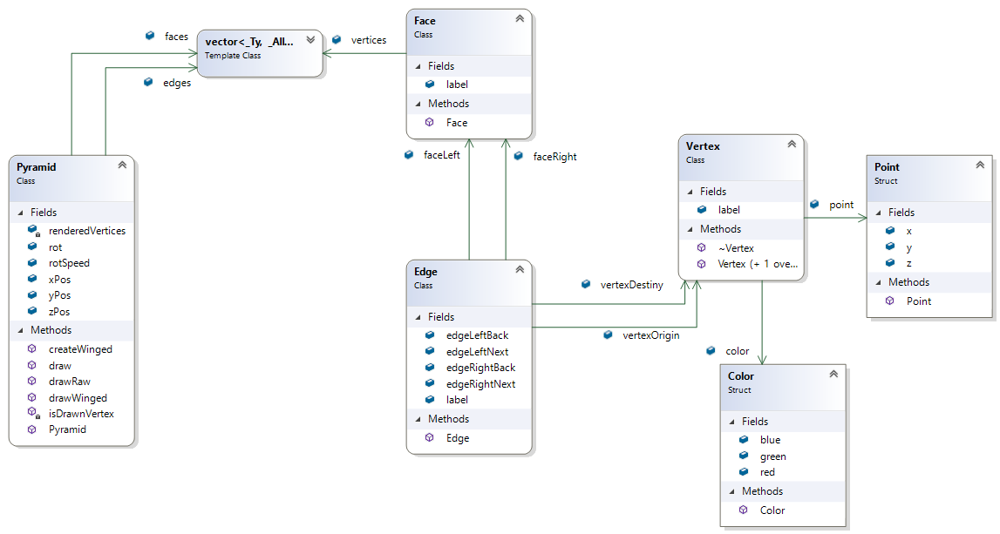
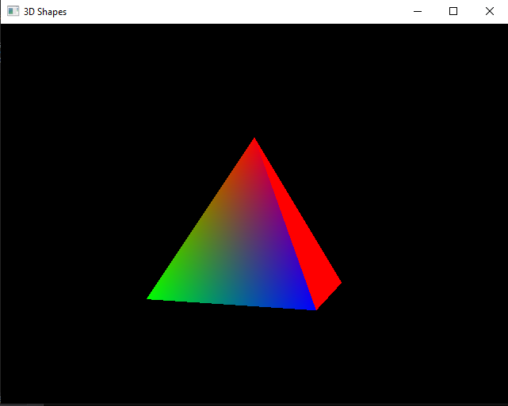
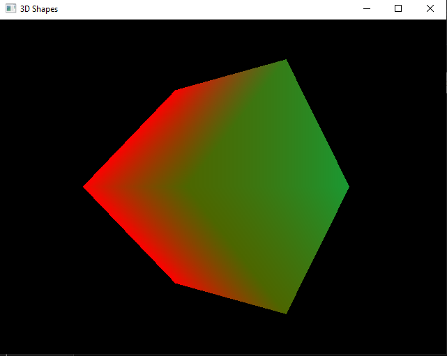

# Pyramid.OpenGL

Pure C++ Visual Studio project with a **3D Pyramid**. This use [OpenGL](https://www.opengl.org/) `version 2` for study and learn.

The code entities is inspired in [Winged-Edge](https://en.wikipedia.org/wiki/Winged_edge) data structure

> **PS:** The last implementation allow render a 3D object from **`.off`** file

## Classes structure

This is a [Class Diagram](https://en.wikipedia.org/wiki/Class_diagram) generated by [Visual Studio Community 2019](https://visualstudio.microsoft.com/pt-br/thank-you-downloading-visual-studio/?sku=Community&rel=16)

## Getting Started

1. Using [Visual Studio](https://visualstudio.microsoft.com/pt-br/vs/?rr=https%3A%2F%2Fwww.google.com%2F), [VSCode](https://code.visualstudio.com/) or any other IDE/Editor that opens a `Solution`

2. Install dependencies using Nuget, from the file `Pyramid.OpenGL/packages.config` and `FileOff.OpenGL/packages.config`

3. **Run** the project and see something like this screen below:

### For cube from .off file

For rendering a cube from a **`.off`** file, follow these additional steps below:

1. Click with right mouse button in the project `FileOff.OpenGL` from the **solution** panel
2. Click on **_Set as startup project_** option
3. **Run** the project and see something like this screen below:

